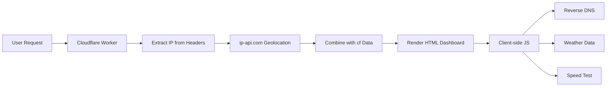

<div align="center">
  
  
  
  
  
  
  <br>
  <br>

  # 🛰️ IPintel — IP Intelligence Dashboard

  <p>
    <strong>A modern Cloudflare Worker-based IP intelligence system that provides real-time insights<br>
    about any visitor's network, location, and device — wrapped in a sleek dark UI and a powerful JSON API.</strong>
  </p>
  
  <p>
    <a href="#-features">✨ Features</a> •
    <a href="#-live-demo">🚀 Live Demo</a> •
    <a href="#-tech-stack">🧰 Tech Stack</a> •
    <a href="#-installation">📦 Installation</a> •
    <a href="#-api-response-example">📡 API Response</a> •
    <a href="#-how-it-works">🧠 How It Works</a>
  </p>
  
</div>

---

## ✨ Features

| Category | Features |
|----------|----------|
| **🧠 Core Intelligence** | Real-time IP detection • Geolocation (Country, City, Region) • ISP & Organization detection • ASN (Autonomous System Number) |
| **🛡️ Security Detection** | Proxy / VPN detection • Hosting detection • Mobile network detection |
| **📡 Network Insights** | Device type detection (Mobile / Desktop / Bot) • Protocol detection • TLS version • Timezone information |
| **🗺️ Location Data** | Latitude & Longitude coordinates • Google Maps integration • Postal code • Region code |
| **🌤️ Extra Features** | Live weather (based on location) • Reverse DNS lookup (PTR record) • Latency test tool • Speed test tool |
| **📄 API Endpoint** | JSON API endpoint (`/json`) • Copy JSON to clipboard • Open API in browser |
| **🎨 User Interface** | Modern dark UI (Zinc-based design) • Smooth animations • Glass morphism effects • Fully responsive • Keyboard shortcut (Ctrl+C to copy IP) |

---

## 🚀 Live Demo

### 🌐 Web Interface
```http
GET /
```

### 📦 JSON API Endpoint
```http
GET /json
```

### Sample Request
```bash
# Get HTML interface
curl https://lively-fire-9856.workerlab.workers.dev/

# Get JSON data
curl https://lively-fire-9856.workerlab.workers.dev/json
```

---

## 🧰 Tech Stack

<div align="center">
  
  | Technology | Purpose |
  |------------|---------|
  | ⚡ **Cloudflare Workers** | Edge runtime & serverless execution |
  | 🌍 **ip-api.com** | Primary geolocation data provider |
  | 🎨 **TailwindCSS** | UI styling & responsive design |
  | 🖥️ **Vanilla JavaScript** | Client-side interactivity |
  | 📡 **Open-Meteo API** | Live weather data |
  | 🔍 **Google DNS API** | Reverse DNS (PTR) lookups |
  | 🗺️ **Google Maps** | Interactive location maps |
  | 🔤 **DM Sans + Space Mono** | Premium typography |

</div>

---

## 📦 Installation

### Prerequisites
- Cloudflare account
- Wrangler CLI installed (`npm install -g wrangler`)

### Steps

```bash
# Clone repository
git clone https://github.com/atmdevx/ipintel.git

# Move into project
cd ipintel

# Login to Cloudflare (if not already)
wrangler login

# Deploy to Cloudflare Workers
wrangler deploy

# Or for local development
wrangler dev
```

### Manual Deployment (via Dashboard)
1. Go to [Cloudflare Dashboard](https://dash.cloudflare.com)
2. Navigate to **Workers & Pages**
3. Click **Create Worker**
4. Copy the code from `index.js`
5. Click **Save and Deploy**

---

## ⚙️ Configuration

### No environment variables required 🚫

The project works out of the box using public APIs:
- `ip-api.com` — Free geolocation API (45k requests/month)
- `open-meteo.com` — Free weather API (no rate limit)
- `dns.google` — Free DNS API (no rate limit)

### Custom Domain Setup (Optional)
```bash
# Add a custom domain to your worker
wrangler deploy --domain ipintel.yourdomain.com
```

---

## 📡 API Response Example

### `GET /json` Response:

```json
{
  "ip": "185.217.141.147",
  "country": "Germany",
  "countryCode": "DE",
  "city": "Frankfurt am Main",
  "region": "Hesse",
  "regionCode": "HE",
  "timezone": "Europe/Berlin",
  "isp": "Deutsche Telekom AG",
  "asn": "AS3320",
  "org": "Deutsche Telekom AG",
  "lat": 50.1109,
  "lon": 8.6821,
  "zip": "60313",
  "protocol": "HTTP/2",
  "tlsVersion": "TLSv1.3",
  "mobile": false,
  "proxy": false,
  "hosting": false,
  "deviceType": "Desktop"
}
```

---

## 🧠 How It Works

```
┌─────────────────────────────────────────────────────────────────┐
│                                                                 │
│   1. User visits yourworker.workers.dev                        │
│                    ↓                                           │
│   2. Cloudflare Worker detects IP via cf-connecting-ip         │
│                    ↓                                           │
│   3. Worker fetches geo data from ip-api.com                   │
│                    ↓                                           │
│   4. Worker combines data with Cloudflare edge info (cf)       │
│                    ↓                                           │
│   5. HTML page renders with all information & animations       │
│                    ↓                                           │
│   6. Client-side JavaScript loads extra data:                  │
│      • Reverse DNS (Google DNS API)                            │
│      • Weather (Open-Meteo API)                                │
│      • Speed test (download simulation)                        │
│                    ↓                                           │
│   7. User can copy IP, test latency, or export JSON            │
│                                                                 │
└─────────────────────────────────────────────────────────────────┘
```

### Data Flow Diagram:



---

## 🔒 Privacy & Security

| Aspect | Status |
|--------|--------|
| Data Storage | 🚫 No data is stored permanently |
| User Tracking | 🚫 No tracking cookies or analytics |
| Logging | 🚫 No IP logging |
| Data Encryption | ✅ TLS 1.3 encryption |
| Data Freshness | ⚡ Real-time only, nothing saved |
| Third-party APIs | 🔐 Public APIs with no authentication |

---

## 🖼️ UI Preview

| Section | Description |
|---------|-------------|
| **🖤 Header** | IP Intelligence brand with security badge |
| **📊 Main IP Card** | Large IP display with copy button & flags |
| **📈 Stats Cards** | ISP, ASN, Organization, Timezone |
| **📍 Location Cards** | City, Region, Postal code, Protocol |
| **🗺️ Coordinates Card** | Latitude/Longitude with Google Maps link |
| **📱 Device Card** | Device type, Security status, Connection type |
| **🌤️ Extra Features** | Reverse DNS, Weather, Speed test |
| **🗺️ Interactive Map** | Embedded Google Maps if coordinates exist |
| **⚡ Action Buttons** | Copy IP, Test Latency, View JSON, Share |
| **📄 JSON Viewer** | Collapsible JSON response viewer |

---

## 🛠️ TODO & Roadmap

- [ ] Add database logging (optional, with D1)
- [ ] Add country analytics dashboard
- [ ] Add rate limiting protection
- [ ] Add custom domain support with SSL
- [ ] Add admin panel for metrics
- [ ] Add support for searching other IPs
- [ ] Add historical data charts
- [ ] Add WebSocket support for real-time updates
- [ ] Add export to CSV/PDF
- [ ] Add multi-language support (i18n)

---

## 🐛 Known Issues

| Issue | Status | Solution |
|-------|--------|----------|
| Rate limiting on ip-api.com | ⚠️ 45 requests/minute | Add fallback to Cloudflare cf data |
| Weather API fails on invalid coordinates | ✅ Fixed | Graceful fallback |
| Reverse DNS timeout | ✅ Fixed | 5s timeout with error handling |
| Proxy detection accuracy | ℹ️ 85-90% | Uses ip-api.com heuristics |

---

## 🤝 Contributing

Contributions are welcome! Please follow these steps:

1. Fork the repository
2. Create a feature branch (`git checkout -b feature/amazing`)
3. Commit your changes (`git commit -m 'Add amazing feature'`)
4. Push to the branch (`git push origin feature/amazing`)
5. Open a Pull Request

### Development Guidelines
- Keep code clean and commented
- Test on Cloudflare Workers dev environment
- Update documentation accordingly
- Ensure responsive design on all devices

---

## 👨‍💻 Author

**Alireza Tahriri**

- GitHub: [@atmdevx](https://github.com/atmdevx)
- Twitter: [@alirezatahriri](https://twitter.com/alirezatahriri)
- LinkedIn: [Alireza Tahriri](https://linkedin.com/in/alirezatahriri)

Built with ⚡ passion for edge computing and beautiful UI

---

## 📜 License

**MIT License** — Feel free to use, modify, and deploy 🚀

```
MIT License

Copyright (c) 2024 Alireza Tahriri

Permission is hereby granted, free of charge, to any person obtaining a copy
of this software and associated documentation files (the "Software"), to deal
in the Software without restriction, including without limitation the rights
to use, copy, modify, merge, publish, distribute, sublicense, and/or sell
copies of the Software, and to permit persons to whom the Software is
furnished to do so, subject to the following conditions...

Full license text available in the LICENSE file.
```

---

<div align="center">
  
  ## ⭐ Show Your Support
  
  If this project helped you or you found it useful, please give it a ⭐ on GitHub!
  
  **Made with ❤️ using Cloudflare Workers**
  
  [Report Bug](https://github.com/atmdevx/ipintel/issues) • [Request Feature](https://github.com/atmdevx/ipintel/issues) • [Star Project](https://github.com/atmdevx/ipintel)
  
  ---
  
  ### 🚀 Deploy Your Own Instance Today!
  
  ```bash
  git clone https://github.com/atmdevx/ipintel.git
  cd ipintel
  wrangler deploy
  ```
  
</div>
